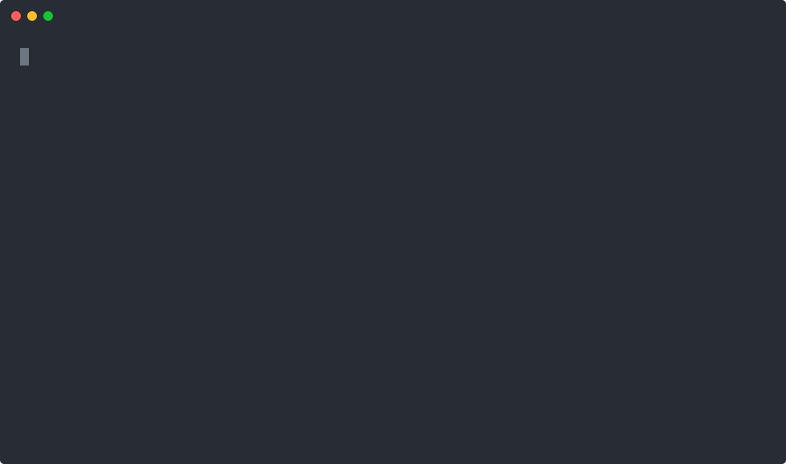

# dAppBooster installer

## Requirements

- Node >= 24.15.0
- pnpm

Requirements for each dAppBooster stack might differ, check the [EVM](https://github.com/bootnodedev/dappbooster/) and [Canton](https://github.com/BootNodeDev/canton-dappbooster) repos for more info.

## Interactive mode



```shell
pnpm dlx dappbooster
```

The wizard will guide you through the different choices available: project name, stack, features, etc.

Alternatively you can start with a pre-selected stack:

- **EVM:** our [blockchain boilerplate](https://dappbooster.dev/) built to quickly get you started with your next EVM project.
- **Canton:** our [local development stack](https://www.dappbooster.cc/) for the Canton network.

```shell
pnpm dlx dappbooster --evm      # EVM stack
pnpm dlx dappbooster --canton   # Canton stack
```

## Non-interactive mode (Agents & CI)

| Flag | Purpose |
|---|---|
| `--canton` / `--evm` | Pick the stack (mutually exclusive shortcuts) |
| `--stack <evm\|canton>` | Pick the stack by name (useful when scripting) |
| `--name <name>` | Project directory name (`/^[a-zA-Z0-9_][a-zA-Z0-9_-]*$/`, so no leading dash) |
| `--mode <full\|custom>` | `full` installs every feature; `custom` needs `--features`. Only for a stack whose `modes` list is not empty |
| `--features <a,b,c>` | Comma-separated feature keys (custom mode only) |
| `--info` | Print stacks and features as JSON and exit. Filter with `--stack`, `--canton` or `--evm` |
| `--ni`, `--non-interactive` | Force non-interactive mode. Auto-enabled when stdout is not a TTY |
| `--help` | Show the usage text |
| `--version` | Show the installer version |

Example: discover stacks and features first, then install.

```shell
pnpm dlx dappbooster --info                  # all stacks + features as JSON
pnpm dlx dappbooster --info --stack canton   # filter to one stack (or --info --canton)
```

### EVM stack

```shell
pnpm dlx dappbooster --evm --ni --name my_dapp --mode full
pnpm dlx dappbooster --evm --ni --name my_dapp --mode custom --features demo,subgraph
```

**Feature options:**

| Feature | Key | Default | Description |
|---|---|---|---|
| Component Demos | `demo` | ✓ | Component demos and example pages |
| Subgraph support | `subgraph` | ✓ | TheGraph subgraph integration |
| Typedoc | `typedoc` | ✓ | TypeDoc API documentation generation |
| Vocs | `vocs` | ✓ | Vocs documentation site |
| Husky | `husky` | ✓ | Git hooks with Husky, lint-staged, and commitlint |

### Canton stack

```shell
pnpm dlx dappbooster --canton --ni --name my_canton_dapp
```

## Installer development

```shell
git clone git@github.com:BootNodeDev/dAppBoosterInstallScript.git
cd dAppBoosterInstallScript
nvm use
corepack enable
pnpm i
pnpm build
node dist/cli.js
```